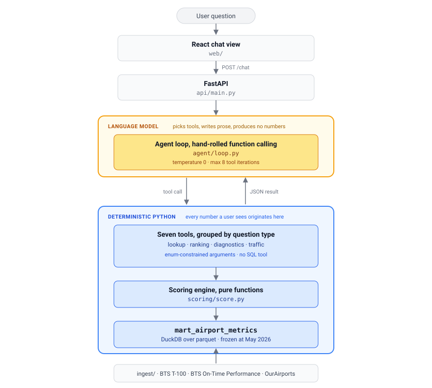

# Design & Architecture

**Airport Investment Intelligence Agent**, a chat agent that ranks US airports
as candidates for expansion capital.

This document covers the three things the brief asks for: the **scoring
methodology**, the **key tradeoffs**, and **where AI is used**. Depth lives
elsewhere and is linked where relevant: [docs/LIMITATIONS.md](docs/LIMITATIONS.md)
(what the numbers can and can't support) and
[docs/DATA_RECON.md](docs/DATA_RECON.md) (how the data was actually obtained).

---

## 1. The thesis

The brief asks where *renovation will be most profitable, based on increased
flight and passenger capacity*. Restated as something scoreable:

> **Renovation creates value where demand is currently suppressed by a physical
> constraint that capital can remove.**

Three conditions must hold *together*:

| Condition | Meaning | Fails when… |
|---|---|---|
| **Demand pressure** | More traffic wants in than can get in | The airport has spare capacity, so there is nothing to unlock |
| **Capacity strain** | The constraint is actively binding | It's busy but still flows smoothly, so there is no upside |
| **Feasibility** | Money can actually remove the constraint | LGA: jammed, but boxed in by water and city |

The design consequence: **ranking on congestion alone is a trap detector, not an
opportunity detector.** It surfaces exactly the airports that cannot expand. This
model scores feasibility as a first-class pillar so those airports are pushed
down, and labels them explicitly (`capacity_trap`) when asked to diagnose one.

---

## 2. Scoring methodology

### 2.1 Shape of the model

Four pillars, each metric converted to a **percentile rank within the airport's
FAA hub-size cohort**, then combined as a weighted sum under a named profile.

| Pillar | Metrics in this build | Source |
|---|---|---|
| **Demand pressure** | `load_factor` (passengers ÷ seats) | T-100 Segment |
| **Capacity strain** | `nas_delay_per_departure`, `taxi_out_p80`, `pct_delayed_15`, `cancellation_rate` | On-Time Performance |
| **Growth trajectory** | *not implemented*, needs multi-year history plus FAA TAF | n/a |
| **Feasibility** | `runways_per_mpax`, `slot_controlled` | OurAirports plus static list |

Every metric declares a **polarity** (`+1` / `-1`) in `config/scoring.yaml`, so a
higher percentile always means "stronger candidate" regardless of whether the raw
metric is good or bad news. Slot control is the only `-1` in the current set: a
cap that capital cannot buy its way past.

Two deliberate choices inside capacity strain:

- **NAS delay, never total delay.** NAS delay isolates congestion caused *at this
  airport* from delay that propagated in from elsewhere in the network. Total
  delay would rank airports by their upstream partners' problems.
- **`completion_gap` was built, tested, and removed.** Departures performed ÷
  scheduled looked like a clean strain signal, but 62% of airports report
  *performed > scheduled* (JFK +23%). It measures carrier schedule-filing
  behaviour, not airport capacity. Evidence in
  [docs/LIMITATIONS.md](docs/LIMITATIONS.md).

### 2.2 Percentiles: national at build time, filtered at query time

Percentiles are computed **once, nationally, within hub-size cohort**, and only
then filtered by region when a question asks for one.

Ranking *within* a filtered subset would make the best airport in any region
score 100 by definition, so "the strongest candidate in New England" would look
identical to "the strongest candidate in the country." A test
(`test_region_filter_after_scoring_matches_national`) asserts the two orderings
differ, so the mistake cannot be reintroduced quietly.

Cohorting by hub size is what makes the percentile meaningful: a 4-minute
taxi-out means something different at a large hub than at a small one. The cost
is that scores are **not comparable across cohorts**. A small airport at the 90th
percentile is not equivalent to a large hub at the 90th, so the agent always
states the cohort.

### 2.3 Composition

```
score = w_demand·DemandPressure + w_strain·CapacityStrain + w_feasibility·Feasibility
```

Weights live in `config/scoring.yaml` under three profiles. They are a
**documented judgment call, not a fitted parameter**, because there is no
labelled outcome data to fit against.

| Profile | Demand | Strain | Feasibility | Rationale |
|---|---|---|---|---|
| `terminal_expansion` | 0.40 | 0.40 | 0.20 | Gate and terminal capital follows demand and how binding strain is; runway room matters less |
| `airfield_expansion` | 0.25 | 0.35 | 0.40 | Runway capital needs the airfield to be the constraint *and* room to add to it |
| `general` | 0.33 | 0.33 | 0.33 | No investment-type bias |

**Missing pillars renormalise, they don't zero.** `growth_trajectory` is absent
for every airport, and `capacity_strain` is absent for the one investable hub
with no OTP match. Each composite is renormalised over the pillars that airport
actually has, so an airport is never silently penalised for a gap in our data
rather than a weakness in its case.

Ties break deterministically: `ORDER BY score DESC, code ASC`.

### 2.4 Confidence is a field, not a footnote

Every payload carries `as_of`, `caveats`, and a structured
`confidence: {value, reason}`. `value` blends three independent reliability
signals: metric coverage (0.4), traffic volume behind the percentile (0.3), and
number of reporting carriers (0.3). `reason` is a short deterministic sentence
naming the single biggest driver, generated in Python:

```
HVN  composite: 40.5   confidence: 0.30 ("no OTP match for May 2026")
     demand_pressure 37.3 | capacity_strain unavailable | feasibility 48.0
```

The agent surfaces `reason` verbatim rather than interpreting the number. A first
attempt scored confidence by counting available pillars; it was rejected because
it returned 0.75 for literally every airport.

### 2.5 Diagnosis

`diagnose_unmet_demand` classifies a single airport from the pillar percentiles
as one of `regulatory_constrained`, `capacity_trap`, `airfield_constrained`,
`terminal_constrained`, `latent_demand_unconstrained`,
`strain_without_demand_pressure`, or `unconstrained`, via a decision tree in
Python reading thresholds from `config/diagnosis.yaml`. The *why* in "what is
SFO's unmet demand and why" is a deterministic classification, never a model
judgment.

---

## 3. Architecture



Everything below the tool layer is deterministic and testable **without a model
call**: the full test suite runs with no API key and no network. Tools are
grouped by *question type* rather than data source, because that's the axis the
model selects on. `tools/data.py` is the single cached reader of the mart, so no
tool reaches past it to a file of its own.

**Data vintage:** one month, **May 2026**, the latest published on TranStats. It
covers roughly 350 commercial airports, of which **135 are investable hubs** (29
large, 29 medium, 77 small). The pipeline is parameterised by year and month, so
widening the window is a config change, but growth trajectory stays unimplemented
until that happens. There is no live data feed, and the agent is instructed to
say so plainly rather than present May 2026 figures as current conditions.

**No live data, by choice.** A `live_traffic_snapshot` tool over OpenSky's public
API was built and then removed. It answered "what is airborne near this airport
right now," which is not a question the investment thesis asks: a multi-year
capital decision is indifferent to this minute's traffic, and it was the only
tool in the system that returned a different answer on every call. Removing it
leaves every tool reading the frozen May 2026 dataset. The risk it used to
absorb, a user asking about current conditions and being handed May 2026 figures
as though they were live, is now handled in the system prompt.

The row-level BTS tables are **not** on the Socrata REST API despite appearing to
be; that domain serves only pre-aggregated summaries for these tables. Ingest
replicates the legacy TranStats ASP.NET form-post
(`__VIEWSTATE`/`__EVENTVALIDATION` plus field checkboxes, returning a generated
zip). Full investigation in [docs/DATA_RECON.md](docs/DATA_RECON.md).

---

## 4. Where AI is used, and where it is not

**The one rule this system is built around: the language model never produces a
number.** It chooses tools and narrates their output. Every figure a user sees is
traceable to a specific tool call.

| Task | Handled by |
|---|---|
| Interpreting natural-language intent | **LLM** |
| Choosing which tool to call, with what arguments | **LLM** |
| Resolving ambiguity ("LA" means LAX, or the whole basin?) | **LLM, by asking the user** |
| Narrating results, maintaining conversation context | **LLM** |
| "New England" into a state list, then an airport set | Deterministic lookup table |
| Every metric, percentile, score and ranking | Deterministic Python |
| Bottleneck diagnosis | Deterministic decision tree |
| Confidence value *and* its stated reason | Deterministic Python |

Three things enforce the rule rather than merely asserting it:

1. **No generic SQL tool, ever.** The model cannot compose a query. Tool
   arguments are enum-constrained, not free strings.
2. **`/chat` returns the full tool-call list** (name, arguments, raw JSON result)
   alongside the prose reply, and the terminal client (`python -m cli`) prints it
   above every answer, so a transcript shows exactly which number came from
   where. The web UI shows prose only; the call log is an audit trail, not
   end-user content.
3. **A reproducibility test** asserts the same query scores identically twice.

Two behaviours are enforced in the loop rather than left to the prompt, because
the model was observed getting them wrong: an ambiguous or empty
`resolve_airports` result forces a clarifying question instead of a guessed code,
and a tool exception becomes an `{"error": …}` result the model can narrate
instead of a dead conversation.

The loop is **hand-rolled OpenAI function calling**, with no LangChain and no
framework. Temperature 0: tool selection should be reproducible, not creative.

---

## 5. Key tradeoffs

| Choice | Gained | Given up |
|---|---|---|
| **Cached data over live APIs** | Authority, grain, reproducibility | Recency, mitigated by stating `as_of` everywhere and refusing to imply live data |
| **Opportunity ranking over ROI modelling** | Every number is defensible | A dollar figure would be more useful, and with no construction-cost source, fabricated |
| **Percentile within cohort over absolute scoring** | Comparisons that mean something | Cross-cohort comparability; the agent states cohort to prevent misreading |
| **Delay as the strain proxy** | The strongest *public* signal available | FAA ASPM/OPSNET throughput-vs-capacity data needs credentialed access; delay carries network-propagation noise, hence NAS delay only |
| **Hand-rolled loop over a framework** | Control flow that can be explained in a paragraph | Framework conveniences that add nothing at seven tools |
| **Breadth over depth** | All ~350 airports, so regional questions return real sets | Per-airport depth: terminal layouts, capital plans, local politics |
| **One month over a trailing year** | Shipped inside the timebox with real row-level data | The entire growth pillar, and two demand-pressure metrics |

---

## 6. Scope, assumptions, limitations

**Out of scope:** ROI/IRR modelling, non-US airports, real-time operational
advice, cargo-only and general-aviation facilities.

**Assumptions:** passenger and flight capacity are the value drivers, per the
brief, so retail, parking and landing fees are not modelled; recent demand
patterns persist; delay is a valid proxy for strain; runway count normalised by
volume stands in for physical headroom, since no national gate-count or land-area
source was found.

**The limitations that most affect a reading of the output:**

1. **Demand pressure rests on `load_factor` alone**, which understates pressure
   at high-frequency hubs. BOS scores 17.2 while BDL scores 53.6. This is the
   single biggest weakness in the current model.
2. **Growth trajectory is absent entirely.** One month of data cannot express a
   trend.
3. **Hub size is derived from one month's passenger share**, where the FAA uses a
   full year.
4. **OTP covers 134 of 135 investable hubs.** HVN has none, and says so in its
   confidence reason.

Each is documented against this build's own output (specific airports,
percentiles, row counts) in [docs/LIMITATIONS.md](docs/LIMITATIONS.md), rather
than as a generic disclaimer.

**What I'd build next:** FAA TAF and multi-month T-100, which unlocks the growth
pillar; NPIAS capital-needs data, to compare opportunity against planned spend;
catchment-overlap modelling, since expanding one airport may cannibalise a
neighbour; and a backtest against airports that actually expanded, to find out
whether any of this predicts anything.
